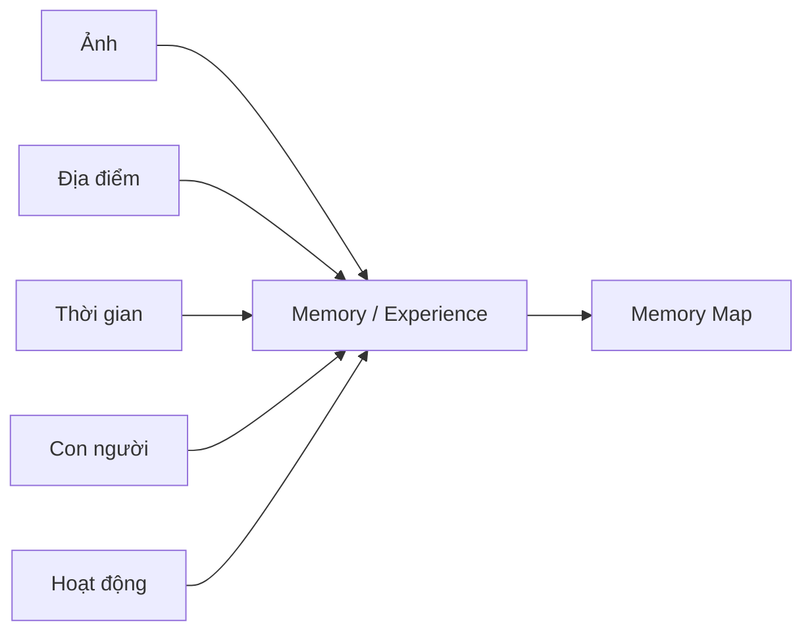

# Mori - Memory Map

### Your life, mapped.

**Những nơi đã đến. Những người đã gặp. Những khoảnh khắc trở thành một phần của bạn.**

Mobile Application · Android (định hướng) · UI/UX Prototype · University Project

## Tổng quan nhanh

| Thông tin | Nội dung |
|---|---|
| Tên dự án | **Mori - Memory Map** |
| Thương hiệu | Mori |
| Loại sản phẩm | Mobile Application |
| Môn học | Lập trình thiết bị di động |
| Đối tượng chính | Gen Z, sinh viên, người trẻ |
| Nền tảng định hướng | Android |
| Giai đoạn hiện tại | UI/UX Design & Project Planning; đã có Figma Prototype |
| Trạng thái phát triển | **Chưa bắt đầu source code** |

## Mục lục

- [Giới thiệu](#1-giới-thiệu-dự-án) · [Bài toán thực tế](#2-bài-toán-thực-tế)
- [Giải pháp](#3-giải-pháp-của-mori) · [Tính năng dự kiến](#4-tính-năng-dự-kiến)
- [Đối tượng người dùng](#5-đối-tượng-người-dùng) · [Điểm khác biệt](#6-điểm-khác-biệt)
- [User Flow](#7-user-flow-chính) · [UI/UX Design](#8-uiux-design)
- [Công nghệ dự kiến](#9-công-nghệ-dự-kiến) · [Trạng thái dự án](#10-trạng-thái-dự-án)
- [Roadmap](#11-roadmap) · [Thành viên nhóm](#12-thành-viên-nhóm)
- [Thông tin môn học](#13-thông-tin-môn-học) · [Hướng phát triển](#14-hướng-phát-triển)
- [Quyền riêng tư](#15-quyền-riêng-tư) · [Project Philosophy](#16-project-philosophy)

## 1. Giới thiệu dự án

**Mori - Memory Map** là ứng dụng di động được đề xuất trong khuôn khổ môn **Lập trình thiết bị di động**. Mori hướng đến việc lưu giữ và khám phá lại trải nghiệm bằng cách kết nối **ảnh, địa điểm, thời gian, con người và hoạt động** thành một **Memory / Experience** — một ký ức có bối cảnh.

Đối tượng cốt lõi của Mori là **trải nghiệm**. Thư viện ảnh giúp người dùng duyệt nội dung; Mori tập trung vào mối liên hệ giữa những khoảnh khắc để người dùng nhớ lại một chuyến đi, buổi gặp gỡ hoặc cột mốc cá nhân. Ý tưởng này đặt trải nghiệm sống làm trung tâm của việc tổ chức ký ức.

> **Mori không chỉ lưu ảnh — Mori lưu lại nơi cuộc sống đã diễn ra.**
>
> *Photos capture moments. Mori connects them into your life.*

## 2. Bài toán thực tế

Người trẻ thường chụp nhiều ảnh, nhưng việc lưu ảnh chưa đồng nghĩa với việc giữ được toàn bộ câu chuyện:

- Ảnh nằm rời rạc trong thư viện; ký ức cũ dễ chìm giữa hàng nghìn nội dung.
- Sau một thời gian, người dùng có thể quên nơi chụp, người đi cùng hoặc hoạt động hôm đó.
- Một chuyến đi có hàng trăm ảnh nhưng thiếu cấu trúc để tái hiện hành trình theo thời gian.
- Mối liên hệ giữa ảnh, người, địa điểm và thời gian chưa luôn rõ ràng, khiến việc khám phá lại trải nghiệm mất nhiều công sức.

Mori được đề xuất để giúp người dùng tìm lại **ý nghĩa và bối cảnh** của những gì đã lưu, thay vì phải tự ghép lại từng chi tiết.

## 3. Giải pháp của Mori

Mori dự kiến nhóm các khoảnh khắc liên quan thành một Experience, bổ sung bối cảnh và đặt trải nghiệm đó lên bản đồ cá nhân. Mỗi Memory là một câu chuyện có thể xem lại qua ảnh, hành trình và những người cùng tham gia.

### Ví dụ: Nha Trang Trip 2026

**Tình huống minh họa:** người dùng đi Nha Trang trong **3 ngày**, có **127 ảnh**, **6 địa điểm** và **4 người bạn**. Đây là số liệu giả định để giải thích ý tưởng, không phải kết quả xử lý của ứng dụng đã triển khai.

Theo định hướng sản phẩm, Mori có thể đề xuất **Nha Trang Trip 2026**: một Memory gồm thư viện ảnh, địa điểm, tuyến đường, timeline từng ngày, người tham gia, ảnh đóng góp qua Shared Memory và các khoảnh khắc nổi bật.

| Ngày | Hành trình minh họa |
|---|---|
| Ngày 1 | Khách sạn → Nhà hàng → Bãi biển |
| Ngày 2 | Đảo → Quán cà phê → Chợ đêm |
| Ngày 3 | Ăn sáng → Trở về nhà |

Người dùng có thể xem lại chuyến đi như một trải nghiệm liền mạch, đồng thời mở từng ảnh khi muốn nhớ một khoảnh khắc cụ thể.

## 4. Tính năng dự kiến

**Toàn bộ tính năng dưới đây nằm trong kế hoạch sản phẩm. Việc lập trình chưa bắt đầu.**

| Tính năng | Trải nghiệm dự kiến |
|---|---|
| **Memory Map** | Bản đồ cá nhân với Memory Marker đại diện cho từng trải nghiệm. |
| **Built-in Camera** | Chụp ảnh trực tiếp trong ứng dụng. |
| **GPS & Timestamp** | Ghi nhận vị trí và thời gian của khoảnh khắc khi được cho phép. |
| **Gallery Import** | Chọn và nhập ảnh có sẵn trên thiết bị. |
| **Memory Grouping** | Nhóm ảnh theo bối cảnh thời gian, vị trí thành một Experience. |
| **Suggested Memory** | Đề xuất Memory từ nhóm ảnh có thể thuộc cùng một trải nghiệm. |
| **Memory Detail** | Xem ảnh, địa điểm, thời gian, người tham gia, highlights và timeline. |
| **Memory Route** | Tái hiện tuyến đường của trải nghiệm. |
| **Memory Timeline** | Sắp xếp các sự kiện trong Experience theo thời gian. |
| **Shared Memory** | Nhiều thành viên cùng đóng góp ảnh cho một trải nghiệm. |
| **Friends** | Kết nối những trải nghiệm giữa bạn bè. |
| **Our Map** | Xem địa điểm và ký ức chung của hai người hoặc một nhóm. |
| **On This Day** | Gợi lại ký ức vào cùng ngày trong quá khứ. |
| **You Are Here Again** | Gợi lại trải nghiệm khi người dùng quay lại địa điểm cũ. |
| **Search** | Tìm theo người, địa điểm, thời gian, ký ức hoặc hoạt động. |
| **Life Statistics** | Xem số Memory, địa điểm, thành phố, người thường đồng hành và nơi ghé nhiều. |
| **Yearly Recap** | Kể lại hành trình trong năm bằng một câu chuyện trực quan. |

## 5. Đối tượng người dùng

- **Gen Z, sinh viên và người trẻ khoảng 18–30 tuổi:** thường xuyên chụp ảnh và muốn lưu lại hành trình cá nhân.
- **Nhóm bạn, cặp đôi:** muốn tập hợp những khoảnh khắc chung từ nhiều người.
- **Người thích du lịch và lưu giữ kỷ niệm:** muốn xem lại nơi đã đến, người đã gặp và trải nghiệm đã có.

Mori được định hướng là ứng dụng di động dành cho người dùng cá nhân: **đơn giản, giàu cảm xúc, trực quan, dễ sử dụng và mobile-first**.

## 6. Điểm khác biệt

Điểm khác biệt nằm ở **định hướng tổ chức sản phẩm**: từ nội dung ảnh sang trải nghiệm có bối cảnh. Bảng dưới mô tả hai cách tiếp cận; các tính năng có thể giao thoa với những ứng dụng ảnh hiện có.

| Cách tiếp cận lấy media làm trung tâm | Mori - Memory Map |
|---|---|
| Media / Photo first | Experience first |
| Album ảnh | Memory / Experience |
| Ảnh theo thời gian | Timeline của một trải nghiệm |
| Dữ liệu vị trí của ảnh | Memory Map của các trải nghiệm |
| Từng ảnh riêng lẻ | Ảnh + người + địa điểm + thời gian + hoạt động |
| Album cá nhân | Shared Memory với người cùng tham gia |
| Tổng kết media | Tổng kết trải nghiệm và hành trình sống |

> **Core idea: Mori organizes experiences, not just photos.**

## 7. User Flow chính

Các luồng dưới đây mô tả trải nghiệm dự kiến và định hướng prototype.

### Chụp và lưu ký ức

Memory Map → Camera → Capture Photo → GPS + Time → Photo Preview → Create / Add Memory → Save → Memory Marker → Memory Detail

### Nhập ảnh thành ký ức

Gallery → Import Photos → Suggested Memory → Review → Create Memory → Memory Map

### Khám phá lại ký ức

Notification / On This Day → Past Memory → Memory Detail

### Trải nghiệm cùng bạn bè

Friends → Friend Profile → Our Map → Shared Memory

## 8. UI/UX Design

**Thiết kế UI/UX và prototype tương tác đã được chuẩn bị trong Figma.** Mori hướng đến phong cách hiện đại, tối giản, thân thiện với Gen Z; giàu cảm xúc, có độ tinh tế và khuyến khích khám phá. Nhiếp ảnh là nội dung trung tâm của giao diện.

- **Nhận diện:** tím / violet làm màu chủ đạo.
- **Hình ảnh và bề mặt:** ảnh có sắc thái ấm, bề mặt sạch, thẻ bo góc và bóng nhẹ.
- **Bố cục:** phân cấp rõ, ít chi tiết thừa, ưu tiên nội dung ký ức và hành động chính.
- **Tương tác:** thiết kế mobile-first, thao tác dễ hiểu, phù hợp việc xem ảnh và khám phá bản đồ trên điện thoại.

<strong>Xem các màn hình đã thiết kế</strong>

| Nhóm màn hình | Màn hình chính |
|---|---|
| Onboarding & Authentication | Splash, Onboarding, Login, Register, Forgot Password, Permissions |
| Map & Camera | Memory Map, Selected Marker, Map Filter, Camera, Memory Mode, Photo Preview |
| Memories | Create Memory, Import Photos, Suggested Memory, Memory Detail, Memory Gallery, Photo Viewer, Memory Route, Memory Timeline |
| Discovery | Main Timeline, Search, Search Results, On This Day, You Are Here Again |
| Friends | Friends, Friend Profile, Our Map, Shared Memory, Invite Friends |
| Reflection | Life Statistics, Yearly Recap |
| Account | Profile, Settings, Privacy, Permission Settings |

### Figma Prototype

[Figma Prototype](https://www.figma.com/design/TgTBKmnQhyOccTuHJ6qtlF/Memory-Map-%E2%80%93-Mobile-App-UI-UX?node-id=0-1&t=hwf2gocraUSDgFM6-1)

## 9. Công nghệ dự kiến

Các lựa chọn dưới đây phục vụ kế hoạch phát triển Android và **chưa được triển khai**.

| Công nghệ | Mục đích | Trạng thái |
|---|---|---|
| Kotlin | Ngôn ngữ lập trình Android | Dự kiến |
| Android Studio | Môi trường phát triển | Dự kiến |
| Jetpack Compose | Xây dựng giao diện | Dự kiến |
| Material 3 | Design System | Dự kiến |
| Git & GitHub | Quản lý phiên bản, cộng tác | Dự kiến |
| Google Maps SDK | Bản đồ | Đang cân nhắc |
| CameraX | Tích hợp camera | Đang cân nhắc |
| Firebase | Xác thực, cloud và đồng bộ | Đang cân nhắc |
| Room | Cơ sở dữ liệu cục bộ | Đang cân nhắc |

## 10. Trạng thái dự án

> **Current Stage:** `UI/UX Design & Project Planning`

| Hạng mục | Trạng thái |
|---|---|
| Xác định ý tưởng | ✅ Hoàn thành |
| Phân tích vấn đề | ✅ Hoàn thành |
| Xác định người dùng | ✅ Hoàn thành |
| Xác định tính năng | ✅ Hoàn thành |
| User Flow | ✅ Hoàn thành |
| UI/UX Design | ✅ Hoàn thành |
| Figma Prototype | ✅ Hoàn thành |
| Android Project Setup | ⏳ Chưa bắt đầu |
| Core Development | ⏳ Chưa bắt đầu |
| Database / Backend | ⏳ Chưa bắt đầu |
| Testing | ⏳ Chưa bắt đầu |
| Final Demo | ⏳ Chưa bắt đầu |

## 11. Roadmap

Giai đoạn nghiên cứu và thiết kế đã hoàn thành. Các giai đoạn phát triển, mở rộng tính năng và kiểm thử thuộc kế hoạch tiếp theo; chưa bắt đầu thực hiện.

<strong>Xem kế hoạch theo 4 giai đoạn</strong>

### Giai đoạn 1 — Nghiên cứu & thiết kế sản phẩm

- [x] Khám phá vấn đề thực tế
- [x] Phân tích vấn đề
- [x] Xác định người dùng mục tiêu
- [x] Xác định ý tưởng cốt lõi
- [x] Lập kế hoạch tính năng
- [x] User Flow
- [x] UI/UX Design
- [x] Figma Prototype

### Giai đoạn 2 — Phát triển Android

- [ ] Thiết lập dự án
- [ ] Điều hướng
- [ ] Xác thực người dùng
- [ ] Memory Map
- [ ] Camera
- [ ] Gallery Import
- [ ] Quản lý Memory

### Giai đoạn 3 — Tính năng xã hội & nhìn lại hành trình

- [ ] Shared Memory
- [ ] Friends
- [ ] Our Map
- [ ] On This Day
- [ ] Search
- [ ] Life Statistics
- [ ] Yearly Recap

### Giai đoạn 4 — Chất lượng & demo cuối kỳ

- [ ] Kiểm thử chức năng
- [ ] Kiểm thử giao diện
- [ ] Tối ưu hiệu năng
- [ ] Rà soát quyền riêng tư
- [ ] Hoàn thiện UI
- [ ] Chuẩn bị báo cáo và thuyết trình cuối kỳ

## 12. Thành viên nhóm

| STT | MSSV | Họ và tên | Vai trò |
|:---:|---|---|---|
| 1 | `074203003699` | **Đoàn Phạm Thanh Tú** | **Nhóm trưởng** |
| 2 | `087206011726` | **Trần Chí Trung** | Thành viên |
| 3 | `001206004489` | **Trần Đức Trung** | Thành viên |

Các thành viên cùng tham gia nghiên cứu sản phẩm, thiết kế giải pháp và phát triển ứng dụng theo kế hoạch của nhóm.

## 13. Thông tin môn học

| Thông tin | Nội dung |
|---|---|
| Môn học | **Lập trình thiết bị di động** |
| Đề tài | **Mori - Memory Map** |
| Loại dự án | Mobile Application |
| Nhóm trưởng | Đoàn Phạm Thanh Tú |
| Số thành viên | 3 |
| Giảng viên | Trương Quang Tuấn |
| Mã học phần | 012012103402 |
| Học kỳ | Học kỳ 1 - 2026-2027 |

## 14. Hướng phát triển

**Ý tưởng tương lai, ngoài phạm vi MVP và chưa phải cam kết triển khai:**

- **Kể chuyện:** AI-generated Memory Story, Video Recap, Physical Photo Book.
- **Khám phá thông minh:** Smart Memory Detection, Activity Recognition, Smart Recommendations.
- **Ký ức chung:** Advanced Shared Memories, Couple Map, Friend Map.
- **Trải nghiệm mở rộng:** AR Memories, Memory Passport, Memory Badges và thống kê cá nhân nâng cao.

## 15. Quyền riêng tư

Mori liên quan đến ảnh, vị trí, con người và trải nghiệm cá nhân. Các nguyên tắc sản phẩm cần được giữ xuyên suốt thiết kế và phát triển:

- Memory **riêng tư mặc định**.
- Vị trí lịch sử không tự động được công khai.
- Shared Memory chỉ được chia sẻ khi người dùng chủ động lựa chọn.
- Chỉ yêu cầu quyền vị trí khi cần cho trải nghiệm liên quan.
- Giải thích rõ mục đích sử dụng quyền camera, ảnh và vị trí.

Đây là định hướng sản phẩm; các cơ chế kỹ thuật bảo vệ dữ liệu chưa được triển khai.

## 16. Project Philosophy

> ### “This isn't where my photos are stored.
> ### This is where my life happened.”

**Mori - Memory Map**

*Your life, mapped.*

---

📚 Dự án được thực hiện phục vụ mục đích học tập  
trong môn **Lập trình thiết bị di động**.

**Mori - Memory Map Team · 2026**

